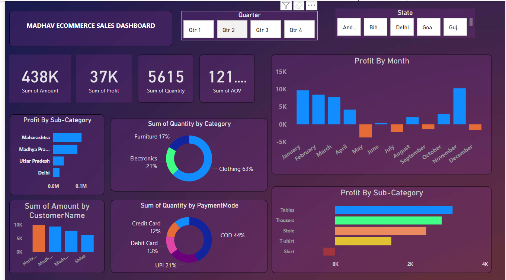

# Madhav Store Sales Dashboard  

## 📝 Objective  
The owner of **Madhav Store** wanted a dashboard to analyze and track **online sales across India**, focusing on key metrics like sales trends, regional performance, and category-wise insights.  

## 🚀 Solution    
1. **Cleaned and transformed** the sales data for analysis.  
2. **Modeled the data** using a star schema to establish relationships between tables.  
3. Created an **interactive Power BI dashboard** with visuals to provide actionable insights.  

## 🛠️ Tools Used  
- **Power BI**: To design and build the dashboard.  
- **Power Query**: For data cleaning and transformation.  
- **Excel**: Source data for the project.  

## 📈 Key Features  
- **KPIs**: Display total sales, revenue, and profit.  
- **Regional Analysis**: Map visualization for sales by state.  
- **Category Trends**: Bar charts to show top-performing categories.  
- **Monthly Insights**: Line chart to visualize sales over time.  
- **Top Products**: Table listing the highest-performing products.  

## 📂 Files in Repository  
- `MadhavStore_Sales.xlsx`: Source dataset.  
- `MadhavStore.pbix`: Power BI project file.  
- `Screenshots/`:  

## 🔗 How to Use  
1. Clone this repository:  
   ```bash
   git clone https://kirti-crypto.github.io/Analytics/

